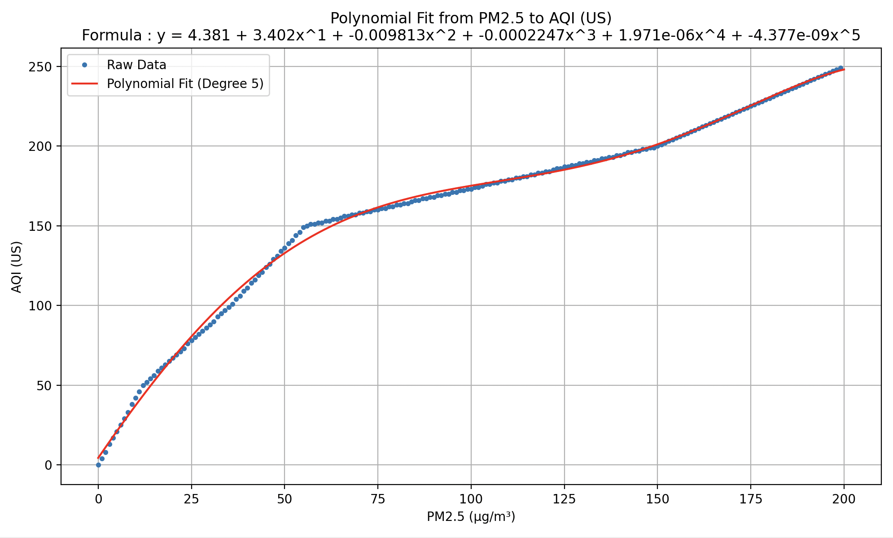

# pm2.5-to-aqi-index-formula

I present the best fit line for conversion of PM2.5 in Micro-gram per cubic meter to PM2.5 in EPA AQI (US) index, in most cases AQI is a lot easier to digest for most people, increase the level by 50 makes sense, but ofcourse it's not linear. 

## Result 
y = 4.381 + 3.402x^1 + -0.009813x^2 + -0.0002247x^3 + 1.971e-06x^4 + -4.377e-09x^5
Thanks for the website aqicn.org for the data of the conversion 