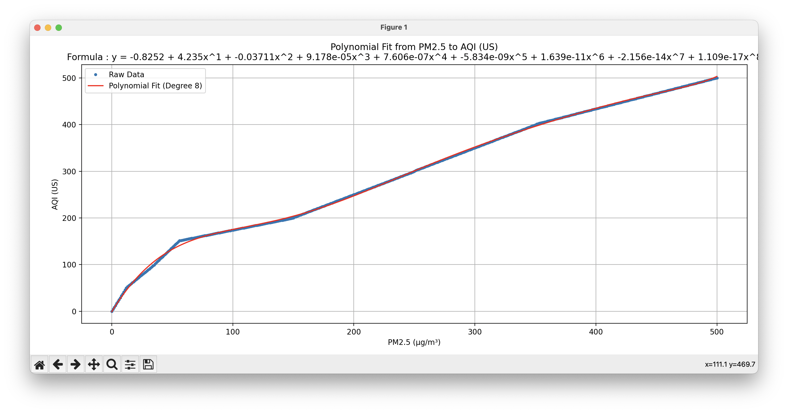

# pm2.5-to-aqi-index-formula (PM2.5 & PM10)

I present the best fit line for conversion of PM2.5 in Micro-gram per cubic meter to PM2.5 in EPA AQI (US) index, in most cases AQI is a lot easier to digest for most people, increase the level by 50 makes sense, but ofcourse it's not linear. 

## Result PM2.5
y = -0.8252 + 4.235x^1 + -0.03711x^2 + 9.178e-05x^3 + 7.606e-07x^4 + -5.834e-09x^5 + 1.639e-11x^6 + -2.156e-14x^7 + 1.109e-17x^8 + 1 
Need to plus 1 for offset at get 0.0 to 0.0

## Result PM10
y = 0.09337 + 0.9743x^1 + -0.001656x^2 + -1.101e-05x^3 + 7.241e-08x^4 + -1.28e-10x^5 + 7.254e-14x^6

Thanks for the website aqicn.org for the data of the conversion 